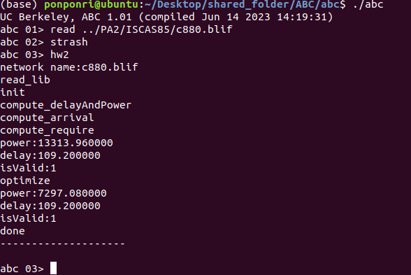
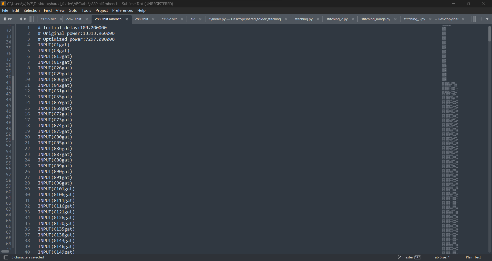
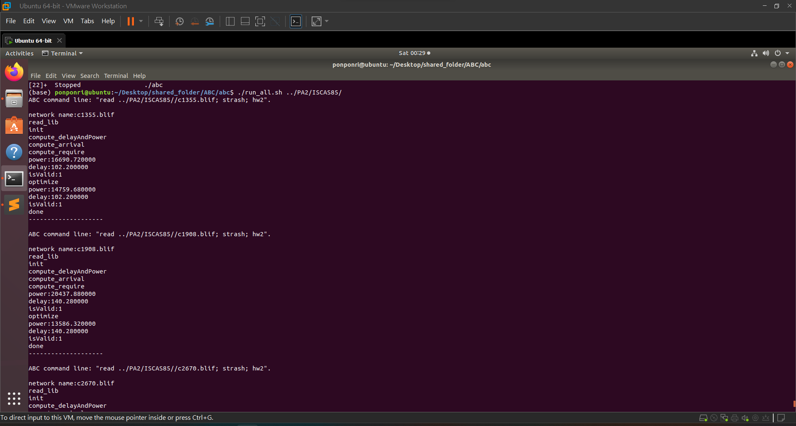
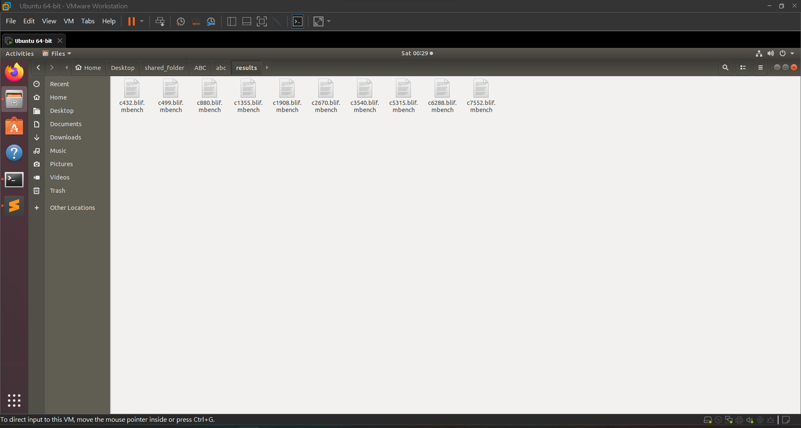

# Programming ABC
## Add file
- src/testC/module.make
- src/testC/testcmd.c
- src/testC/testC.c
- src/testC/testC.h

## Change Code
- Makefile
- src/base/main/mainInit.c

# Target
- Implement technology mapping with abc and create addition command on it.
- Input files: pa2.lib(cell lib), filename.blif(network)
- Output file: filename.blif.mbench(optimize netlist)

# Steps of hw2
1. Read ../PA2/pa2.lib (cell lib)
2. Read network with abc (filename.blif)
3. Strash network to AIG format with abc
4. Create network graph with our code (and, inv, and buf)
5. Compute initial delay and its original power for every gate 
6. Check is valid or not (slack >=0 -> valid)
7. Optimize power with decrease greatest slack gate power if its power can be optimize
8. Continue step 8 until slack cannot be optimize
9. Check is valid or not (slack >=0 -> valid)
10. Save initial delay, original power, optimize power, and netlist to filename.blif.mbench  

# Environment
- Ubuntu 
- gcc (Ubuntu 7.5.0-3ubuntu1~18.04) 7.5.0
- g++ (Ubuntu 7.5.0-3ubuntu1~18.04) 7.5.0


# Folder Architecture
- Need to put PA2 and abc in same folder.
- If you want to change input cell lib(like pa2.lib), you need to modify the code in abc/src/base/testC/testc.h ( #define LIB_NAME "../PA2/pa2.lib" )
```
abc/
    Makefile
    run_all.sh
    src/
        base/
            main/
                mainInit.c
        testC/
            module.make
            testC.c
            testC.h
            testcmd.c
    results/
        c432.blif.mbench
        c499.blif.mbench
        c880.blif.mbench
        c1355.blif.mbench
        c1908.blif.mbench
        c2670.blif.mbench
        c3540.blif.mbench
        c5315.blif.mbench
        c6288.blif.mbench
        c7552.blif.mbench
PA2/
    pa2.lib
    ISCAS85/
        c432.blif
        c499.blif
        c880.blif
        c1355.blif
        c1908.blif
        c2670.blif
        c3540.blif
        c5315.blif
        c6288.blif
        c7552.blif

```
# Compile Project
```
cd abc
make
```
# Run Code

1. Use abc command with one input network: (output file with save at abc/filename.blif.mbench)
```
cd abc
./abc
read filename.blif 
strash
hw2
quit
```

2. Run script with multiple network store in one folder: (output file with save at abc/results/filename.blif.mbench)
```
cd abc
./run_all.sh {input folder} # ex: ./run_all.sh ../PA2/ISCAS85/
```
# Results
1. abc command mode

    c880.blif
    
    c880.blif.mbench
    

2. script mode

    ../PA2/ISCAS85/
    
    abc/results/
    


